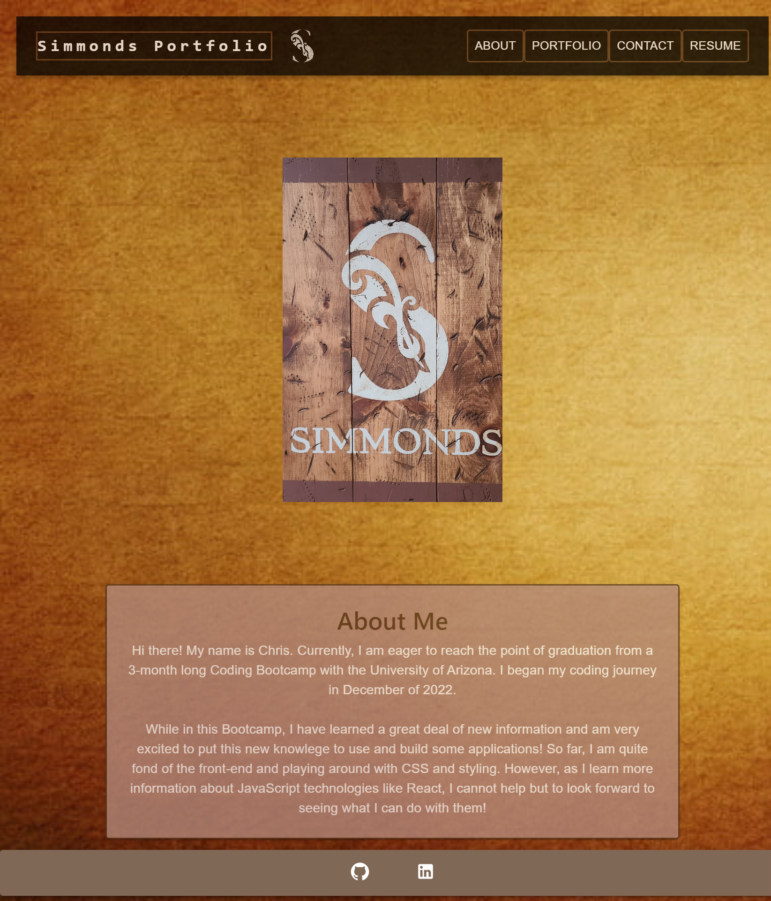

# Simmonds-React-Portfolio

  

## Description

This is a site developed using react to showcase all I've learned so far from the coding bootcamp and present a professional portfolio to potential employers. I decided to familiarize myself with some additional npm dependencies during this project. MUI has some really useful and aesthetic component structures. I learned a good deal about manupulating elements and strive to keep imporving the overall aesthetic and user experience. 

## Table of contents
- [Installation](#Insallation)
- [Deployment](#Deployment)
- [Mockup](#Mockup)
- [Usage](#Usage)
- [Contribution](#Contributing)
- [Test](#Test)
- [Questions](#Questions)

## Installation

I am using the following dependencies for this application:
 - [React](https://www.npmjs.com/package/react) - Version 18.2.0
 - [React-Router-Dom](https://www.npmjs.com/package/react-router-dom) - Version 6.8.2
 - [React-Dom](https://www.npmjs.com/package/react-dom) - Version 18.2.0
 - [React-Scripts](https://www.npmjs.com/package/react-scripts) - Version 5.0.1
 - [MUI/Material](https://mui.com/material-ui/getting-started/installation/) - Version 5.11.11
    - Also using mui/icons-material and mui/styled-engine-sc
 - [Bootstrap](https://www.npmjs.com/package/bootstrap) - Version 5.2.3
 - [Prop-Types](https://www.npmjs.com/package/prop-types) - Version 15.8.1

 For additional packages, please see the associated package.json file.

## Deployment

This is currently deployed on Github Pages - https://christoph551.github.io/Simmonds-React-Portfolio/

## Mockup

## Usage

I invite all who are viewing this repository to visit the Portfolio and provide me with some feedback. I am open to positive and constructive criticisms. There is a fully functional Contact Me view that will allow you to shoot me an email. Simply enter your name, email and a message! 

## Collaborators

Josh Minor, Anthony Frederick

## Test

npm run test

## Questions

Have questions? Please feel free to reach out to me at:

GitHub Username: [Christoph551](https://github.com/Christoph551)

Email: [Email](mailto:christophersimmonds551@gmail.com)